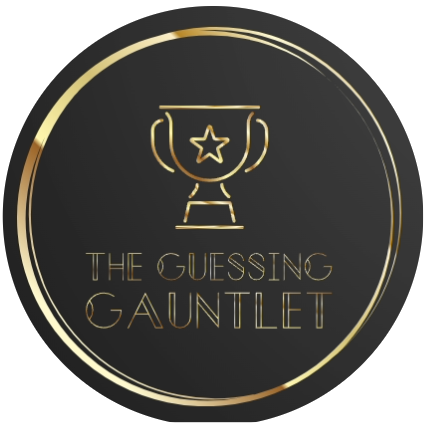

<div style="padding-left: 100px;">
  
</div>

# The Guessing Gauntlet 

The Guessing Gauntlet is a multiplayer guessing game where three players compete to guess a randomly generated number between 0 and 10. The player who correctly guesses the number wins the game.

## How to Play

1. **Three Players**: Gather a group of three players to participate in the Guessing Gauntlet.

2. **Make a Guess**: Each player must choose a number between 0 and 10 as their guess for the game.

3. **Random Number**: The website will generate a random number between 0 and 10.

4. **Determine the Winner**: The player whose guess matches the generated number wins the game.


## Interface 
### Landing Page


### Game Console


<!-- Add additional screenshots as needed -->
## Contributing
We welcome contributions! Follow these steps to contribute to the Guessing Gauntlet project:

1. Fork the repository.

2. Create a new branch for your feature or bug fix:

```bash
git checkout -b feature/your-feature-name
Make your changes and commit them:
```

3. Make your changes and commit them:
```bash
git commit -m "Add your feature or fix"
Push your branch to your fork:
```
4. Push your branch to your fork:

```bash
git push origin feature/your-feature-name
```

5. Open a pull request.
